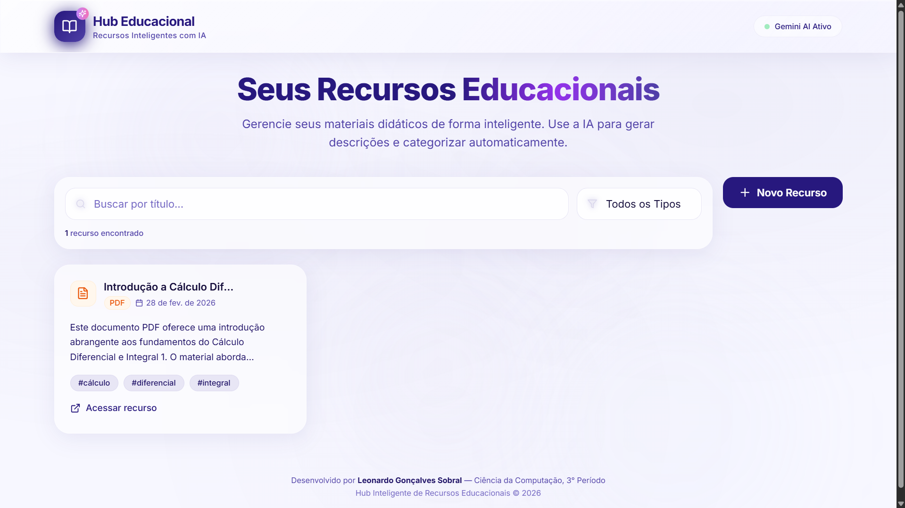
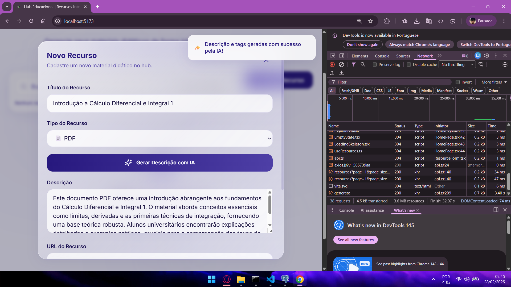

<p align="center">
  <strong>Autor: Leonardo Gonçalves Sobral</strong><br>
  <em>19 anos — Ciência da Computação — 3° Período</em>
</p>

# Hub Inteligente de Recursos Educacionais

---

## 1. Introdução

O **Hub Inteligente de Recursos Educacionais** é uma aplicação full-stack moderna projetada para o gerenciamento centralizado de materiais didáticos. A plataforma permite que educadores e alunos cadastrem, organizem e acessem recursos como vídeos, PDFs e links, com o diferencial de um **Smart Assist** baseado em Inteligência Artificial (Google Gemini) que gera descrições pedagógicas e tags automaticamente.

O projeto foi construído com uma stack tecnológica de ponta, focando em performance, escalabilidade e uma experiência de usuário (UX) refinada. A interface, inspirada no design da Apple, utiliza conceitos de **Glassmorphism** e **Liquid Glass** para criar um ambiente visual limpo e moderno, enquanto animações fluidas, orquestradas por **Framer Motion** e **anime.js**, guiam o usuário de forma intuitiva.

## 2. Demonstração

### Site em produção (Deployed)
A aplicação está disponível online:  
**https://hub-educacional.vercel.app**

### Capturas de tela / Funcionamento

#### Tela Principal — Listagem de Recursos

<p align="center">
  
</p>

A tela principal exibe os recursos educacionais cadastrados, com busca por título, filtro por tipo e paginação. O indicador de status do **Gemini AI** é exibido no canto superior direito, confirmando que o serviço de IA está ativo (quando configurado).

#### Cadastro de Novo Recurso — Geração com IA

<p align="center">
  
</p>

O formulário de cadastro permite informar título, tipo e URL do material. Ao clicar em **"Gerar Descrição com IA"**, o sistema utiliza o Google Gemini para gerar automaticamente uma descrição pedagógica e tags de categorização.

## 3. Stack Tecnológica

A arquitetura do projeto é dividida em dois serviços principais: um backend RESTful e um frontend SPA (Single Page Application).

| Camada             | Tecnologia         | Descrição                                                                                             |
| :----------------- | :----------------- | :---------------------------------------------------------------------------------------------------- |
| **Frontend**       | React 18           | Biblioteca declarativa para construção de interfaces reativas.                                       |
|                    | Vite               | Build tool de alta performance com Hot Module Replacement (HMR).                                     |
|                    | TypeScript         | Superset do JavaScript que adiciona tipagem estática.                                                 |
|                    | Tailwind CSS       | Framework CSS utility-first para design rápido e customizável.                                        |
|                    | Framer Motion      | Biblioteca de animação para React, utilizada para transições e microinterações.                       |
|                    | anime.js           | Engine de animação leve, usada para efeitos complexos no background.                                   |
|                    | Axios              | Cliente HTTP para comunicação com o backend.                                                           |
| **Backend**        | Python 3.11        | Linguagem principal do backend.                                                                        |
|                    | FastAPI            | Framework web de alta performance para construção de APIs.                                            |
|                    | Pydantic v2        | Validação de dados e gerenciamento de configurações.                                                   |
|                    | SQLAlchemy 2.0     | ORM assíncrono para interação com o banco de dados.                                                    |
| **Banco de Dados** | PostgreSQL         | Banco de dados relacional robusto e escalável.                                                         |
| **IA**             | Google Gemini      | Modelo de linguagem utilizado para a funcionalidade "Smart Assist".                                    |
| **DevOps**         | GitHub Actions     | CI/CD para automação de linting, formatação e testes.                                                  |

## 4. Funcionalidades Principais

- **CRUD Completo de Recursos**: Crie, leia, atualize e exclua recursos educacionais.
- **Listagem Paginada com Filtros**: Busca por título, filtro por tipo (Vídeo, PDF, Link) e paginação server-side.
- **Smart Assist (IA)**: Gera descrições pedagógicas e tags com um clique, usando Google Gemini (quando a API estiver configurada).
- **Engenharia de Prompt Avançada**: Backend encapsula a engenharia de prompt para obter respostas consistentes da IA em JSON.
- **UX/UI Moderno**:
  - **Glassmorphism & Liquid Glass**
  - **Animações Baseadas em Física** (Framer Motion)
  - **Loading States Sofisticados** (skeletons e shimmer)
- **DevOps & Observabilidade**:
  - **CI/CD** com linters (`black`, `flake8`) e testes (`pytest`).
  - **Logs Estruturados** para monitoramento.
  - **Health Check**: endpoint `/health`.
- **Segurança**: Chaves de API via variáveis de ambiente e nunca expostas no repositório.

## 5. Arquitetura e Decisões Técnicas

### Backend (FastAPI)
O backend segue o padrão **Service Layer** para isolar a lógica de negócio dos endpoints.

- **`main.py`**: Configura o FastAPI, CORS, rotas e lifecycle hooks.
- **`core/`**: Configurações e utilitários (`config.py`, `database.py`, `logging.py`).
- **`models/`**: Modelos ORM (ex.: `Resource` com tipos PostgreSQL como `ARRAY` para tags).
- **`schemas/`**: DTOs com validação Pydantic.
- **`services/`**: Lógica de negócio (`resource_service.py`, `ai_service.py`).
- **`api/`**: `APIRouter` com endpoints que delegam ao service layer.

### Frontend (React)
Arquitetura de componentes reutilizáveis e hooks customizados:

- **`main.tsx`**, **`App.tsx`**
- **`pages/`**, **`components/`**, **`hooks/`**
- **`services/api.ts`** centraliza chamadas Axios com interceptors.
- **`styles/globals.css`** contém definições de Glassmorphism e utilitários Tailwind.

#### Animações
- **Framer Motion**: animações reativas ao estado (springs: stiffness, damping).
- **anime.js**: efeitos contínuos no DOM (orbs, background).

## 6. Setup e Execução Local

### Pré-requisitos

- Node.js (v18+)
- Python (v3.10+)
- PostgreSQL
- Git

### 1. Clonar

```bash
git clone https://github.com/leozitogs/hub_educacional.git
cd hub_educacional
```

### 2. Backend

```bash
cd backend
python -m venv .venv
.venv\Scripts\activate
pip install -r requirements.txt
cp .env.example .env
```

Rodar:

```bash
uvicorn app.main:app --reload
```

### 3. Frontend

```bash
cd frontend
npm install
npm run dev
```

---

## 7. API

| Método | Endpoint |
|-------|---------|
GET | /resources
POST | /resources

---

<p align="center"> 
   <strong>Desenvolvido com 💙 por Leonardo Gonçalves Sobral</strong> 
</p>